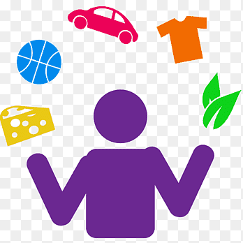

## Hello  <𝚌𝚘𝚍𝚎𝚛𝚜/>! I'm Mohammad Mizanur Rashed

---

I'm a passionate Full Stack Developer From Chittagong Bangladesh
 

---

###  About Me:

- I am An enthusiastic person with highly motivated & leadership
  skills having bachelors of M.A degree with professional IDB-BISEW diploma on
  Web Application Development with PHP and Frameworks (WDPF)
- Eager to learn new knowledge & methodologies.
- Always willing to innovate the new things which can improve
  my skills.
- Disciplined & good etiquette.
- Positive thinker.

<h3 align="left">📢 Connect with me:</h3>

 <h3 align="left">🔥 My Skills:</h3>
 

               

---

    

  

### 👨🏻‍🎓 Education :

| M.A 2017                 | B.A 2016                 |
| ------------------------ | ------------------------ |
| University of Chittagong | University of Chittagong |

### 🌐 Languages :

| Bangla | English | Arabic |
| ------ | ------- | ------ |
| Native | Advence | Basic  |

###  Hobbies

<ul dir="auto">
<li><g-emoji class="g-emoji" alias="cricket_game" fallback-src="https://github.githubassets.com/images/icons/emoji/unicode/1f3cf.png">🏏</g-emoji> Cricket, <g-emoji class="g-emoji" alias="soccer" fallback-src="https://github.githubassets.com/images/icons/emoji/unicode/26bd.png">⚽</g-emoji> Football, <g-emoji class="g-emoji" alias="badminton" fallback-src="https://github.githubassets.com/images/icons/emoji/unicode/1f3f8.png">🏸</g-emoji> Badminton, <g-emoji class="g-emoji" alias="chess_pawn" fallback-src="https://github.githubassets.com/images/icons/emoji/unicode/265f.png">♟️</g-emoji> Chess, <g-emoji class="g-emoji" alias="volleyball" fallback-src="https://github.githubassets.com/images/icons/emoji/unicode/1f3d0.png">🏐</g-emoji> Volleyball</li>
<li><g-emoji class="g-emoji" alias="swimming_man" fallback-src="https://github.githubassets.com/images/icons/emoji/unicode/1f3ca-2642.png">🏊&zwj;♂️</g-emoji> Swimming, <g-emoji class="g-emoji" alias="running_man" fallback-src="https://github.githubassets.com/images/icons/emoji/unicode/1f3c3-2642.png">🏃&zwj;♂️</g-emoji> Running, <g-emoji class="g-emoji" alias="walking_man" fallback-src="https://github.githubassets.com/images/icons/emoji/unicode/1f6b6-2642.png">🚶&zwj;♂️</g-emoji> Walking</li>
<li><g-emoji class="g-emoji" alias="airplane" fallback-src="https://github.githubassets.com/images/icons/emoji/unicode/2708.png">✈️</g-emoji> Travelling</li>
</ul>

